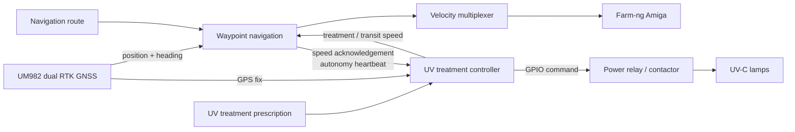

# PPB-OTR-UVC

**Prescription-based autonomous UV-C treatment for specialty crops**

[](https://github.com/YiyuanLinXX/PPB-OTR-UVC/actions/workflows/ci.yml) [](LICENSE) [](https://docs.ros.org/)

PPB-OTR-UVC is an autonomous field-robotics platform for site-specific UV-C treatment in vineyards and other specialty crops. It combines dual-antenna RTK GNSS navigation with a treatment prescription: the robot energizes its UV lamps only inside prescribed zones, slows down to deliver the configured treatment, and travels faster between treatment zones.

[Watch the field demonstration](assets/PPB_OTR_UVC_web.mp4) · [Project page](https://yiyuanlinxx.github.io/robots/ppb-otr-uvc)

> [!CAUTION]
> UV-C radiation can injure eyes and skin. This repository is research software, not a certified safety system. Its software interlocks do not replace a physical emergency stop, keyed enable, shielding, warning indicators, access control, or a site-specific risk assessment. Read [SAFETY.md](SAFETY.md) before connecting a lamp power circuit.

## What the system does

1. A navigation route guides the Farm-ng Amiga through crop rows using a UM982 dual-antenna RTK-GNSS receiver.
2. A separate UV treatment prescription lists the geographic boundaries at which the lamps turn `ON` and `OFF`.
3. Before the lamp power output is energized, the treatment controller requests the slower UV-treatment speed and waits for the navigation controller to acknowledge it.
4. The lamps are forced off if GNSS becomes invalid or stale, autonomous navigation is inactive, another velocity source takes control, the speed acknowledgement is missing, or the node shuts down.
5. Mission progress is saved after every treatment boundary so an interrupted route can be resumed deliberately.



The power relay is the electrical actuator; **UV treatment is the application**. The ROS package retains the historical name `relay_control` for deployment compatibility, while its public interfaces and documentation use UV-treatment terminology.

## Highlights

- Prescription-map-based UV lamp switching in strict route order
- Dynamic treatment and transit speeds for dose-oriented operation
- Dual-antenna heading and RTK position from a UM982 receiver
- PID line following, pure pursuit, rollout MPC, formal MPC, and hybrid row controllers
- GPIO mock mode for development without lamp hardware
- Fail-safe lamp-off behavior and persistent mission recovery
- Detection of narrowly missed treatment boundaries with GNSS-noise filtering

## Repository layout

| Path | Purpose |
| --- | --- |
| `src/relay_control` | UV treatment sequencing, GPIO power-stage control, speed coordination, and safety gates |
| `src/amiga_navigation` | UM982 GNSS driver, waypoint follower, motion controllers, velocity arbitration, and Amiga serial bridge |
| `examples` | Synthetic, non-field treatment prescription example |
| `docs` | Architecture, configuration, and operating notes |
| `assets` | Project media |

## Requirements

- Ubuntu or another Linux environment supported by your ROS 2 distribution
- ROS 2 with `colcon`, `rosdep`, and `twist_mux`
- Python 3.10 or newer
- A UM982-compatible GNSS receiver and robot base for field operation
- Raspberry Pi GPIO support (`gpiozero` with the `lgpio` backend) for physical lamp switching

The pure logic tests do not require ROS or hardware.

## Build

Clone this repository into a ROS 2 workspace, then install dependencies and build both packages:

```bash
source /opt/ros/$ROS_DISTRO/setup.bash
rosdep install --from-paths src --ignore-src -r -y
colcon build --symlink-install
source install/setup.bash
```

## Configure

Never put a real field prescription or NTRIP credentials in a public checkout. Create local copies of the safe templates:

```bash
mkdir -p ~/.config/ppb-otr-uvc
cp src/amiga_navigation/config/bringup.yaml \
  ~/.config/ppb-otr-uvc/bringup.yaml
cp src/relay_control/config/uv_treatment.yaml \
  ~/.config/ppb-otr-uvc/uv_treatment.yaml
```

Update the local files with your serial devices, antenna geometry, treatment prescription path, progress path, and GPIO pin. The prescription format is:

```csv
latitude,longitude,action
42.000000,-76.000000,ON
42.000010,-76.000000,OFF
```

Actions must alternate, begin with `ON`, and end with `OFF`. The coordinates in [`examples/uv_treatment_waypoints.example.csv`](examples/uv_treatment_waypoints.example.csv) are synthetic. See [Configuration](docs/CONFIGURATION.md) for parameter details.

## Run

Start the GNSS, velocity multiplexer, safety monitor, and Amiga bridge:

```bash
ros2 launch amiga_navigation basic_bringup.launch.py \
  bringup_config:=$HOME/.config/ppb-otr-uvc/bringup.yaml
```

In a second terminal, start treatment-aware waypoint navigation:

```bash
source install/setup.bash
ros2 launch relay_control uv_navigation.launch.py \
  navigation_waypoints:=/absolute/path/to/navigation_waypoints.csv \
  uv_config:=$HOME/.config/ppb-otr-uvc/uv_treatment.yaml \
  follower_config:=/absolute/path/to/waypoint_follower_params.yaml
```

To exercise treatment logic without physical GPIO, set `mock_gpio: true` in your local UV configuration. Mock mode is for software verification only.

## Test

From the repository root:

```bash
python3 -m pip install pytest pyproj
python3 -m pytest
```

The current suite covers prescription parsing and ordering, treatment-boundary recovery, progress persistence, navigation safety gates, and UM982 protocol parsing. Hardware-in-the-loop validation remains the operator's responsibility.

## Documentation

- [System architecture](docs/ARCHITECTURE.md)
- [Configuration reference](docs/CONFIGURATION.md)
- [Safety guidance](SAFETY.md)
- [Contributing](CONTRIBUTING.md)
- [Security policy](SECURITY.md)

## Citation

If this software supports your research, cite the repository metadata in [`CITATION.cff`](CITATION.cff). A publication-specific citation can be added when a peer-reviewed system paper is available.

## License

Released under the [Apache License 2.0](LICENSE). Hardware designs, third-party components, crop-treatment protocols, and vendor software may have separate terms and are not licensed by this repository.

## Maintenance

For any questions or uncertainty, please contact Yiyuan Lin ([yl3663@cornell.edu](mailto:yl3663@cornell.edu)).
