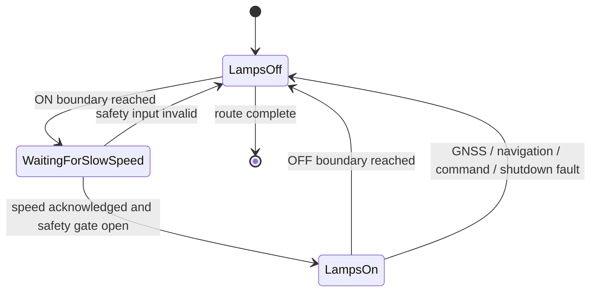

# System architecture

PPB-OTR-UVC separates robot motion from UV treatment decisions. Each subsystem has a narrow interface so that treatment sequencing and safety rules can be tested without GNSS, ROS, GPIO, or lamp hardware.

## Data flow

| Producer | Interface | Consumer | Purpose |
| --- | --- | --- | --- |
| UM982 driver | `/gps/fix` | navigation and UV controller | Validated GNSS position |
| UM982 driver | `/robot/odom` | waypoint follower | Local position and heading |
| UV controller | `/uv_treatment/target_speed` | waypoint follower | Treatment or transit speed request |
| Waypoint follower | `/navigation/active_target_speed` | UV controller | Acknowledges the active speed limit |
| Waypoint follower | `/navigation/uv_treatment_enable` | UV controller | Indicates autonomous treatment motion is active |
| Waypoint follower | `/cmd_vel_nav` | `twist_mux` and UV controller | Navigation velocity request |
| `twist_mux` | `/cmd_vel_out` | Amiga bridge and UV controller | Selected robot velocity command |
| UV controller | GPIO | relay/contactor input | Enables or removes UV lamp power |

Topic names are configurable. The defaults above are kept consistent in the checked-in templates.

## Treatment state sequence

Treatment boundaries are processed in CSV order. The controller rejects odd row counts, non-alternating actions, invalid coordinates, and an `OFF` first action. A small hysteresis distance prevents overlapping boundaries from causing multiple changes at one position. Optional missed-boundary recovery requires a confirmed approach followed by several samples moving away.

## Safety gates

Lamp power can be requested only when all configured gates pass:

- the GNSS fix is valid and recent;
- waypoint navigation publishes a recent active heartbeat;
- navigation and selected robot velocity commands are recent and agree within configured tolerances;
- the follower acknowledges the treatment speed;
- the ordered treatment sequence currently requests `ON`.

The GPIO output is initialized off, commanded off during faults and shutdown, and closed after use. These are software risk controls, not safety certification; see [UV-C safety](../SAFETY.md).

## Recovery model

After each treatment boundary, the controller atomically writes a JSON progress record containing the prescription fingerprint and next boundary index. Resume is allowed only when the absolute prescription path, SHA-256 fingerprint, row count, and saved index all agree. A changed prescription starts a new mission.

## Package boundary

`amiga_navigation` owns sensing, localization inputs, path tracking, velocity arbitration, and the base serial bridge. `relay_control` owns UV treatment intent, the GPIO power-stage command, and the cross-checks that prevent UV activation outside autonomous treatment motion. The latter name is retained as a stable ROS package identifier; applications should use the `uv_treatment_node` executable.
